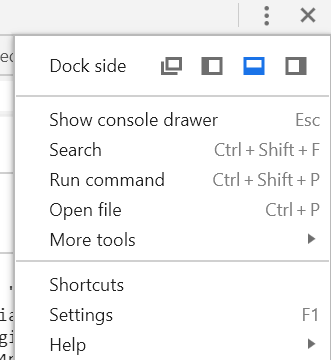
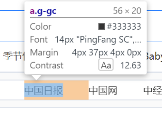
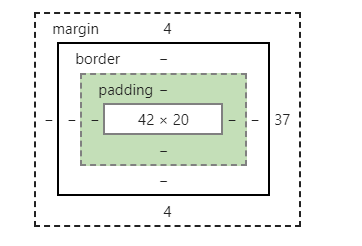
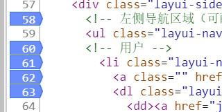
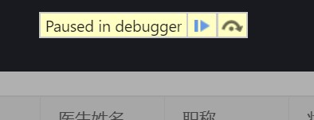
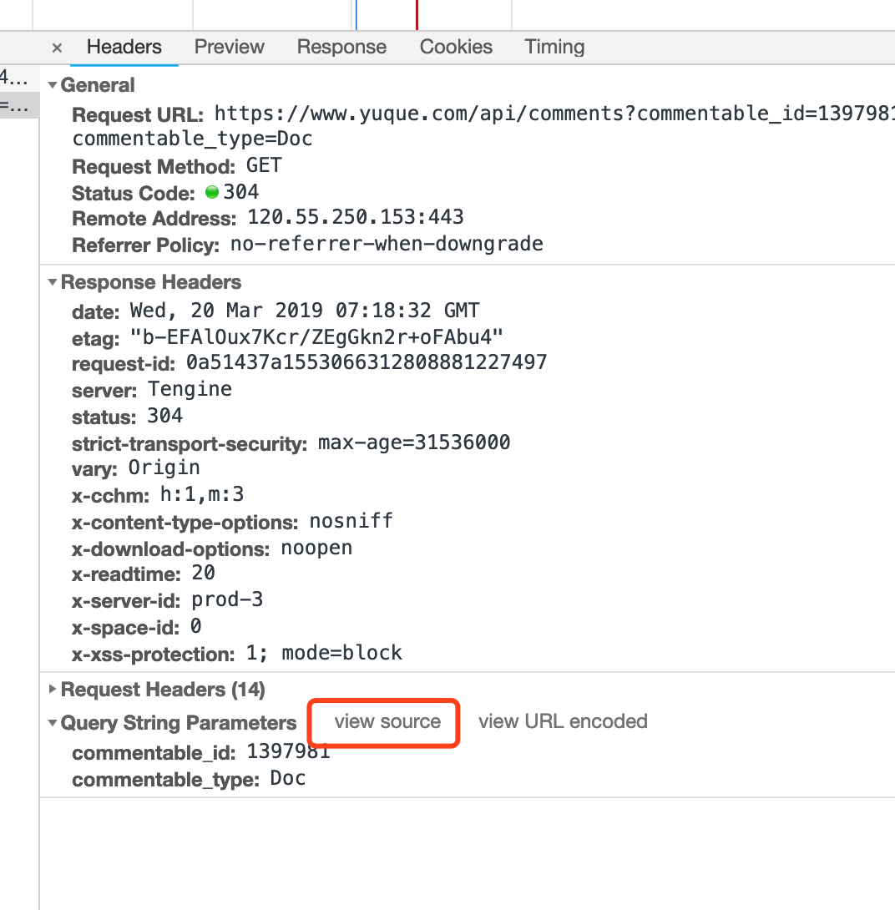
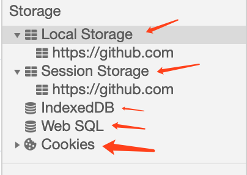

## 1、F12调试按钮
    首先用你的谷歌浏览器打开你所要操作的页面，并点击F12，即可看到如下图所示：

    有可能一开出现在浏览器的右侧，会影响到你的布局，没有关系。

    看到右上角有竖着三点的按钮，如下图所示：  
    

    根据你的需求进行dock side的切换，一般情况下，会显示在浏览器下方。

## 2、快速定位
    点击调试界面的左上方有一个鼠标按钮，如右图所示：
。
当你选中时，图标会编程蓝色，如右图所示：

    让此图标呈选中状态，把鼠标移至你所要操作的控件上，如下图所示：

你所选中的控件会被阴影覆盖，会有一个显示层，如上图所示，

横线上方显示控件的名称，类名，和空间的大小。
横线的下方显示空间的样式。
选择你所要的控件，点击此控件。

调试界面会跳出此界面，如下图所示：

左边蓝色的框即为你选中的控件的代码，右边为此控件的样式。

对于右边控件的样式，你可以点击进行修改操作，更加直观的调整你的布局，当调整好后，再去修改你的代码，可以节省很多切换界面的时间。

继续看右边的界面，你会找到如右图所示：

styles:为查看你的样式，上图已说，这里不再细说。

点击Computed，即可看到如下图所示：

把鼠标移到上面，即可看到你所选控件的空间布局。

## 3、断点调试：

这个为调试器。如下图所示，点击打开：

打开后可看到左边为你的项目目录，你可以选择你所需要调试的文件，选中你所要调试的文件，右边便会弹出文件内容。

找到你所要调试的代码，点击该行的条目数，会出现如下图所示：

如果所要调试的是该页面，则刷新就可进行调试，如果是对某操作的调试，则进行该操作进入调试。

如出现上图所示，则标识成功进入到调试状态

蓝色按钮(第一个按钮 or F8)：切换到下一个断点位置，如果已是最后一个断点则结束调试。

黑色按钮(第二个按钮 or F10)：执行下一步操作，如果已是最后一个步骤，则结束测试。

## 4、查看请求接口

下图为网络，可以用来查看请求的接口

打开后即可看到上图所示界面。

上图这个按钮可以用来过来http的请求，能够快速找到请求接口

选中你所要查看的接口

上图为查看http响应，不过数据结构很难看出来，可以选用下面的按钮

上图能够看到请求头和响应头的消息

上图红色圈出来的按钮可以用于拷贝入参，很高效

上图可以快速查看到console的警告和错误数量

## 5、其他操作

上图最左边的类似手机图像的按钮：能切换移动设备模式，用于调试移动端页面很有效

Elements：查看器，步骤2已说过，在补充一点：把鼠标移到代码上，相应的控件会有颜色标识，也能够快速定位。

Console：控制台，js上的输出，你所引用的路径，会在此显示出来。

Sources：调试器，3已说明

NetWork：网络，4已说明

其他的基本没什么用，就不用说了。

