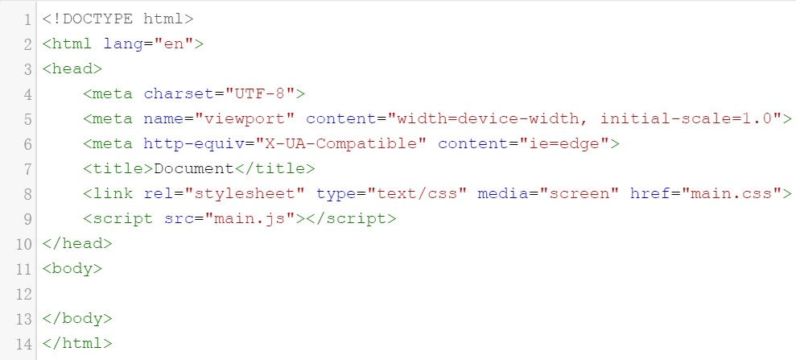

    
# HTML语言基础功能

## 一、标签的含义

### 1、<!DOCTYPE html

    声明必须是 HTML 文档的第一行，位于 <html> 标签之前

    <!DOCTYPE> 声明不是 HTML 标签；它是指示 web 浏览器关于页面使用哪个 HTML 版本进行编写的指令。

    在 HTML 4.01 中，<!DOCTYPE> 声明引用 DTD，因为 HTML 4.01 基于 SGML。DTD 规定了标记语言的规则，这样浏览器才能正确地呈现内容。

    在 HTML 4.01 中有三种 <!DOCTYPE> 声明。在 HTML5 中只有一种：<!DOCTYPE html>

### 2、<html

    该标签定义了文档的开始点和结束点，在他们之间是文档的头部和主体。

### 3、<head

    该标签定义文档的头部，所有头部元素的容器。

    描述了文档的各种属性和信息

    头部包含的数据都不会真正的作为内容显示给读者

### 4、<meta

    用来描述一个HTML网页文档的属性。

### 5、<title

    网页的标题

### 6、<link

    定义与外部资源的关系

    最常见的用途是链接样式表

### 7、<script

    定义客户端脚本

    既包含脚本语句，也可以通过src属性指向外部脚本文件

    必需的 type 属性规定脚本的 MIME 类型

### 8、<body

    定义文档的主体

## 二、每行属性

### 1、lang="en" or "zh"

    表示该页面的html语言

    en代表english

    zh代表中文

### 2、charset="UTF-8"

    charset规定HTML文档的字符编码

### 3、name="viewport"

    此参数为配置移动端的界面，具体参数参照下个条目

### 4、content="width=device-width, initial-scale=1.0"

    width=device-width  //应用程序的高度和屏幕的宽度是一样的
    width=device-height //应用程序的高度和屏幕的高是一样的
    initial-scale=1.0   //应用程序启动时候的缩放尺度（1.0表示不缩放）
    minimum-scale=1.0   //用户可以缩放到的最小尺度（1.0表示不缩放）
    maximum-scale=1.0   //用户可以缩放到的最大尺度（1.0表示不缩放）
    user-scalable=no    //用户是否可以通过他的手势来缩放整个应用程序

### 5、http-equiv="X-UA-Compatible" content="ie=edge"

    http-equiv:相当于http文件头的作用可以向浏览器传回一些有用的信息以帮助正确的显示网页的内容

    可以有一下几个参数：

        X-UA-Compatible：

            针对IE8新加的一个设置，对于IE8之外的浏览器是不识别的

            参数值可以为：IE=5、6、7、8、edge(锁定以最高级别的可用模式显示内容)

        Expires(期限):

            可以用于设定网页的到期时间。一旦网页过期，必须到服务器上重新传输。

            <metahttp-equiv="expires"content="Fri,12Jan200118:18:18GMT"> 

        Pragma(cache模式)：

            禁止浏览器从本地计算机的缓存中访问页面内容

            <metahttp-equiv="Pragma"content="no-cache"> 

        Refresh(刷新):

            自动刷新，并指向新页面

            <metahttp-equiv="Refresh"content="2;URL=http://www.jb51.net">(注意后面的引号，分别在秒数的前面和网址的后面)

        Set-Cookie(cookie设定) ：

            如果网页过期，那么存盘的cookie将被删除

            <metahttp-equiv="Set-Cookie"content="cookievalue=xxx;expires=Friday,12-Jan-200118:18:18GMT；path=/"> 

        

### 6、rel="stylesheet"

    rel:规定当前文档与被链接文档之间的关系

    最常用的为stylesheet:文档的外部样式表，其值得到了所有浏览器的支持

    如果想了解其他的属性值，可以参考http://www.w3school.com.cn/tags/att_link_rel.asp

    此代码表示为层叠样式表

### 7、type="text/css“

    type:规定样式表的MIME型

    “text/css”:指内容是标准的CSS

    此代码表示为类型是CSS

### 8、media="screen"

    media:为不同的媒介类型规定不同的样式

    screen：计算机屏幕（默认值）

    projection：放映机

    print：打印预览模式，打印页

### 9、href="main.css"

    href:路径
    
    main.css为层叠样式表的名字

### 10、src="main.js"

    引用外部脚本的路径